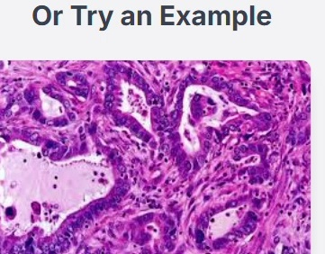
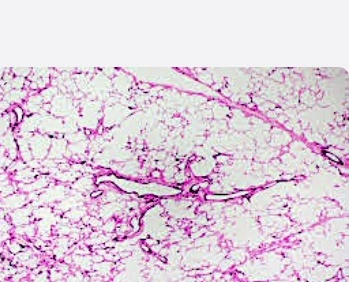
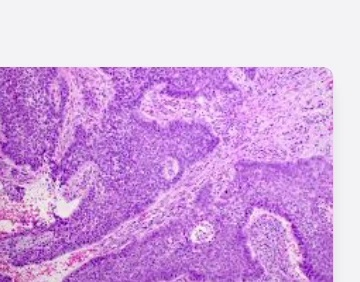
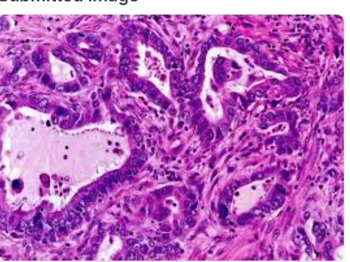
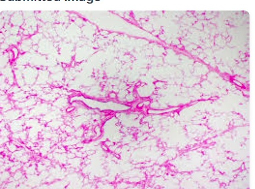

# Lung Detector AI

A TensorFlow/Keras + Flask project for **educational image classification of lung histopathology samples**.

> ⚠️ **Educational use only.** This project is a machine-learning demonstration and is **not a medical device and not a substitute for diagnosis, pathology review, or clinical decision-making.**

## 🔬 What the project does

Lung Detector AI classifies an input histopathology image into one of three project classes:

- **Adenocarcinoma**
- **Normal**
- **Squamous**

The web app provides image upload, model prediction, confidence scores, example result views, and training-metric visualization when artifacts are available.

## 🧠 Approach

The training pipeline uses **EfficientNetB0** with transfer learning:

1. Resize images to **224 × 224**
2. Apply augmentation: flip, rotation, zoom, contrast, and translation
3. Use ImageNet-pretrained EfficientNetB0 as the feature extractor
4. Train a classification head
5. Fine-tune the upper backbone layers
6. Save the best checkpoint and training artifacts

The dataset is loaded with an 80/20 train-validation split.

## 🧪 Demo gallery

The repository already contains example/result images used by the UI:

| Adenocarcinoma | Normal | Squamous |
|---|---|---|
|  |  |  |

Example result views are also available:

| Adenocarcinoma result | Normal result |
|---|---|
|  |  |

## 📊 Results and evaluation

This repository intentionally does **not** claim an accuracy/F1 score until the model is trained and evaluated on a real dataset.

After training, run:

```bash
python evaluate_model.py
```

The evaluation script writes:

- `artifacts/evaluation_metrics.json`
- `artifacts/confusion_matrix.png`

The report contains accuracy, macro F1, weighted F1, per-class precision/recall/F1, and the confusion matrix.

## 📁 Dataset structure

Place your dataset under `dataset_images/`:

```text
dataset_images/
├── Adenocarcinoma/
├── Normal/
└── Squamous/
```

Each class folder should contain the corresponding histopathology images.

## 🚀 Run locally

Install dependencies:

```bash
pip install -r requirements.txt
```

Train the model:

```bash
python train_model.py
```

Evaluate the trained model:

```bash
python evaluate_model.py
```

Start the Flask app:

```bash
python app.py
```

Open:

```text
http://127.0.0.1:5000
```

## 🗂️ Project structure

```text
lung-detector-ai/
├── app.py
├── train_model.py
├── evaluate_model.py
├── index.html
├── script.js
├── styles.css
├── requirements.txt
├── assets/
│   └── lung-detector/
└── README.md
```

## ⚠️ Model/data note

The trained model, dataset, and generated evaluation artifacts are not committed to this repository by default. Train locally with your authorized dataset, then inspect the generated metrics before publishing any performance claim.

## 🛠️ Stack

**Python · TensorFlow/Keras · EfficientNetB0 · Flask · NumPy · Pillow · scikit-learn · Matplotlib**
